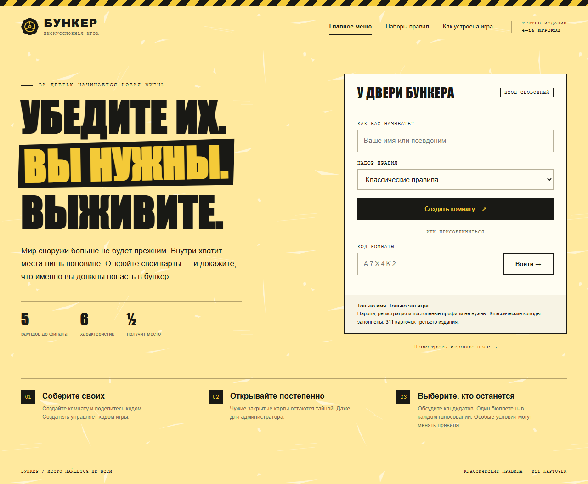
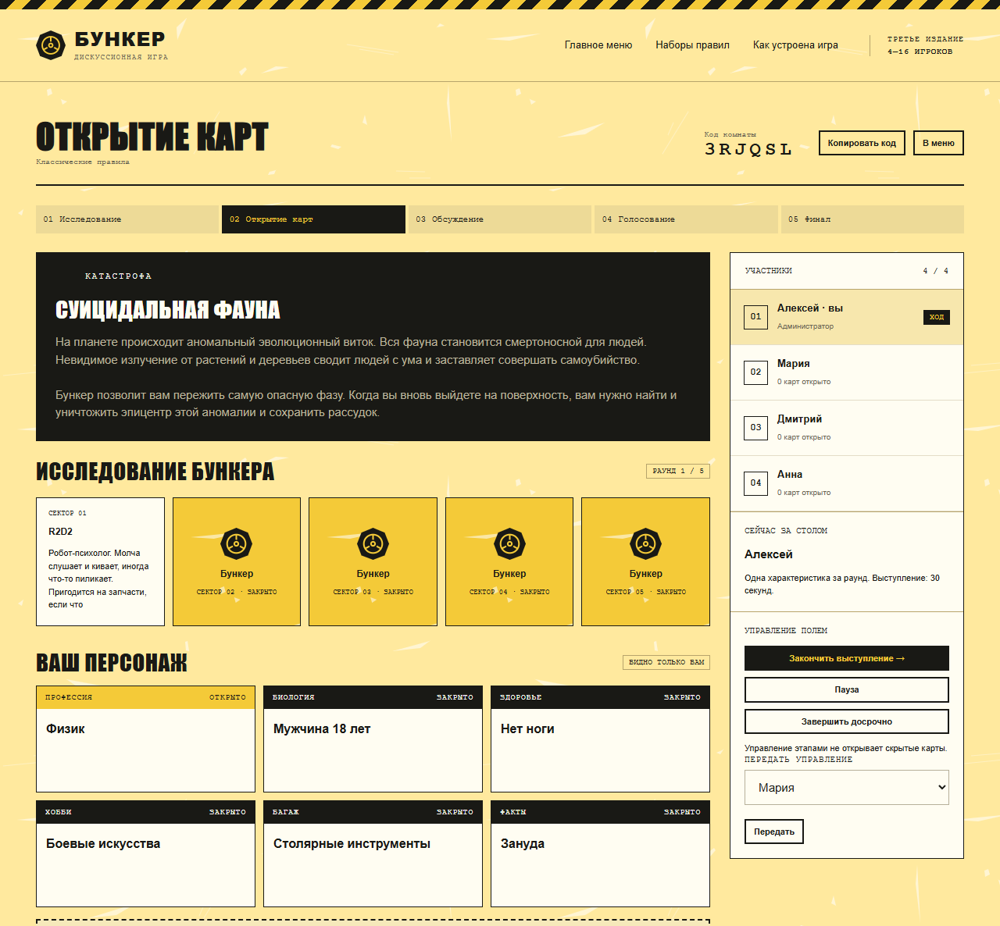
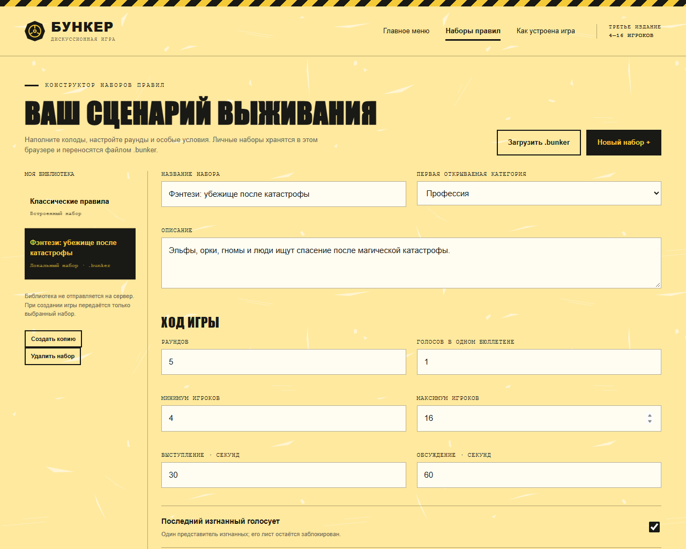
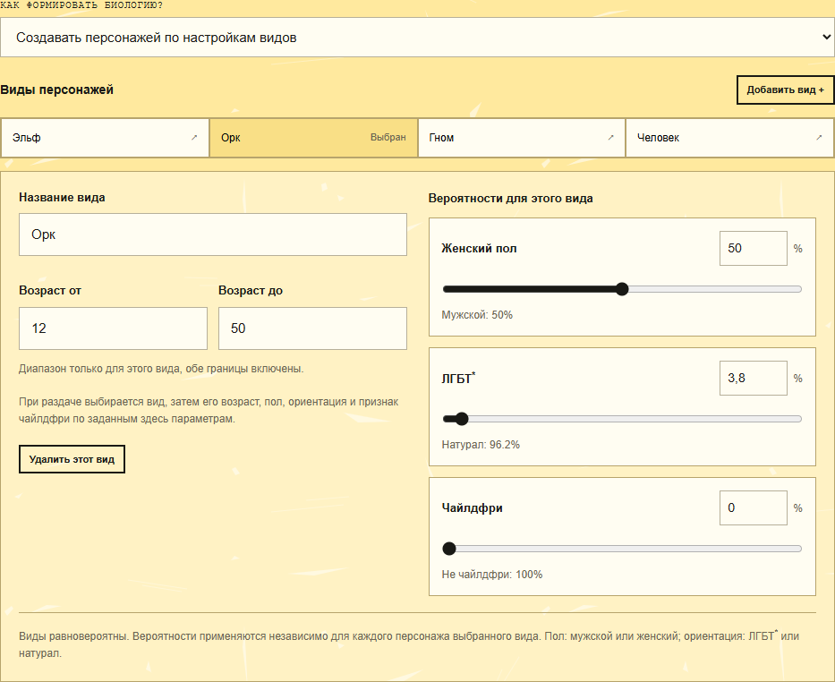
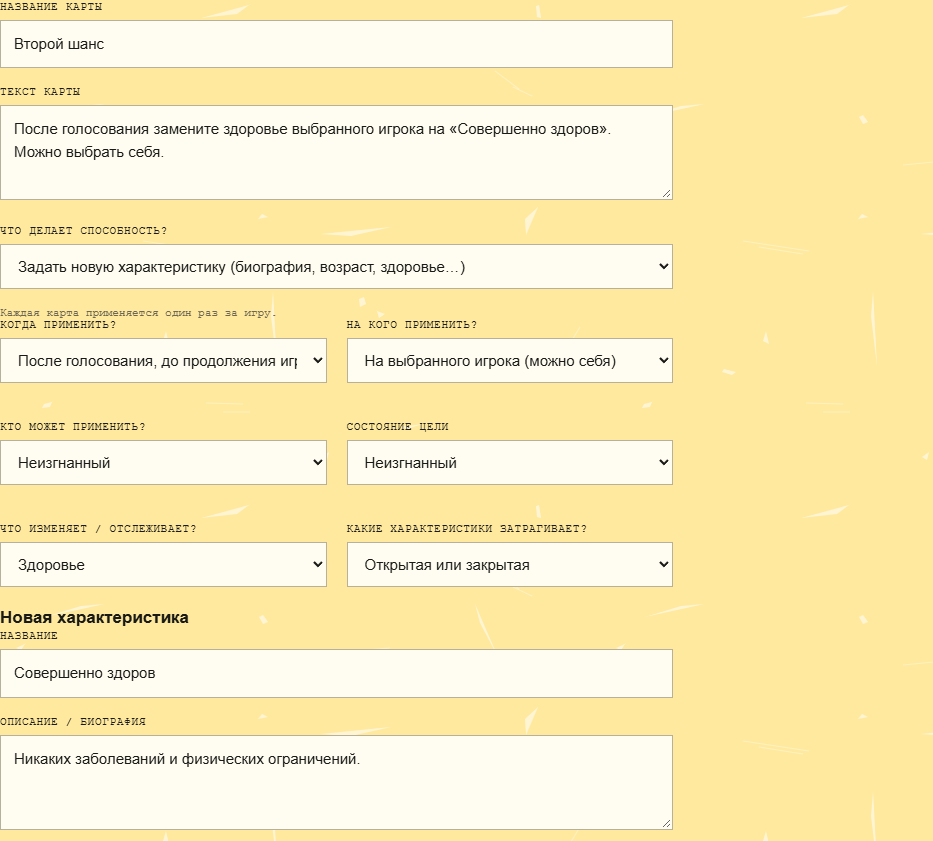

# Бункер

**Соберите друзей, получите персонажей и убедите остальных, что именно вы нужны в убежище.**

«Бункер» — дискуссионная игра для **4–16 человек**. После катастрофы мест в убежище хватает лишь части группы.
Игроки постепенно раскрывают свои характеристики, спорят о пользе каждого и голосуют, кого оставить снаружи.
Приложение раздаёт карты, ведёт раунды и подсчитывает голоса. Аргументы, договорённости и неожиданные решения — за вами.

Можно играть за одним столом с телефонами или удалённо, общаясь в привычном голосовом сервисе.
Участникам нужен только браузер; приложение запускает один человек на своём компьютере или сервере.

[Первая партия](#первая-партия) · [Свой набор правил](#свой-набор-правил) · [Запуск у себя](#запуск-у-себя)



## Зачем выбирать эту версию

Она подойдёт компании, которая хочет проводить собственные партии и менять игру под себя.

- **Свой сервер.** Вы выбираете, где запускается игра и когда она доступна. После первоначальной установки можно
  играть в одной локальной сети без доступа к интернету.
- **Готовая классика.** Уже есть 311 карточек третьего издания: характеристики персонажей, катастрофы, бункер,
  особые условия и угрозы. Для первой партии ничего составлять не нужно.
- **Свои сценарии.** Меняйте колоды и категории, число раундов, расписание голосований и спецвозможности.
  Например, создайте фэнтезийный пак с эльфами, орками, гномами и людьми.
- **Переносимые паки.** Скачайте набор одним файлом `.bunker`, сохраните резервную копию или передайте другу.
  Для партии достаточно загрузить пак создателю комнаты.
- **Без аккаунтов и подписки внутри приложения.** Для входа нужны имя и код комнаты. Стоимость аренды сервера,
  если вы решите его арендовать, зависит от выбранного вами хостинга.

### Чем это удобно по сравнению с готовыми онлайн-сервисами

Главное преимущество здесь — возможность разместить игру у себя и подготовить переносимый набор с собственными
правилами. Вы можете заранее собрать сценарий для своей компании и проводить его в домашней сети.

У [официальной онлайн-версии](https://bunker-game.com/bunker-online) есть бесплатный доступ,
а подписка открывает дополнительные карты и контент. Здесь встроенная классика и редактор доступны без подписки.
При этом бесплатные альтернативы тоже существуют: например,
[bunker-game.online](https://bunker-game.online/) предлагает публичные игры, автоматические таймеры и встроенное
общение, но не предоставляет возможность создавать свои коллекции карточек.
Эта версия рассчитана на свою компанию: этапами управляет администратор, а разговаривают участники за столом
или в отдельном звонке.

## Первая партия

Если организатор уже прислал адрес игры, устанавливать ничего не нужно. Откройте этот адрес в браузере.
Если вы организатор и приложение ещё не запущено, начните с раздела [«Запуск у себя»](#запуск-у-себя).

1. **Создатель комнаты:** введите имя, выберите «Классические правила» и нажмите **«Создать комнату»**.
2. **Пригласите друзей:** отправьте им адрес приложения и код комнаты. Код виден вверху игрового поля;
   его можно скопировать кнопкой **«Копировать код»**.
3. **Остальные игроки:** откройте тот же адрес, введите своё имя и код, нажмите **«Войти»**.
   Выбирать или загружать набор правил участникам не требуется.
4. **Дождитесь всех:** для классики нужны 4–16 человек. После начала партии вход новых игроков закрывается.
5. **Создатель комнаты:** нажмите **«Начать игру»**. Вы получите персонажей и узнаете, какая катастрофа произошла.

Создатель становится администратором и одновременно остаётся обычным игроком. Отдельный человек без персонажа
для ведения партии не нужен. При необходимости управление можно передать другому участнику.

Чтобы сначала познакомиться с интерфейсом, нажмите **«Посмотреть игровое поле»** в главном меню.
Это демонстрация, а настоящая партия начинается после создания комнаты.

## Как играть

В классике у персонажа шесть характеристик: **профессия, биология, здоровье, хобби, багаж и факт**.
Дополнительно каждый получает спецкарту. Свой лист вы видите сразу, но другим участникам его ещё предстоит раскрыть.



*На примере показан первый раунд комнаты на четырёх игроков. Карты персонажа видны владельцу;
отметка «Закрыто» означает, что остальные их пока не видят.*

1. **Исследуйте бункер.** В начале раунда откройте очередной сектор: он добавляет условия для обсуждения.
2. **Раскрывайте персонажей.** Каждый по очереди открывает одну характеристику и объясняет свою пользу.
   В первом раунде классики открывается профессия. После выступления администратор нажимает
   **«Закончить выступление»**, чтобы передать ход.
3. **Обсуждайте кандидатов.** Решите, какие навыки, вещи и качества важнее в условиях вашей катастрофы.
4. **Голосуйте.** Когда по расписанию наступает голосование, администратор открывает его.
   Выберите кандидата на изгнание и нажмите **«Отдать голос · без изменения»**.
   Обычный отправленный бюллетень исправить нельзя; решения остальных станут видны после завершения голосования.
5. **Продолжайте партию.** При ничьей кандидаты защищаются, затем проводится повторное голосование между ними.
   Повторная ничья разрешается случайным выбором. В финале все карты раскрываются: обсудите,
   сможет ли выбранная группа выжить и чего ей не хватает.

Не в каждом раунде есть голосование: расписание зависит от числа игроков. Оно показано перед стартом,
а таблицу для классики можно посмотреть в разделе **«Как устроена игра»**.
В классике последний изгнанный голосует от лица изгнанных; обычное раскрытие его характеристик уже заблокировано.

Администратор может поставить партию на паузу. Время выступлений и обсуждений — ориентир для компании:
**автоматического таймера и перехода по истечении времени пока нет**.
Итоговую историю выживания приложение не сочиняет — судьбу группы обсуждают сами участники.

### Как применять спецвозможности

Прочитайте текст своей карты и подсказку о времени применения. Способность можно использовать вне своего хода,
если её условия разрешают это в текущий момент. **Каждая спецкарта применяется один раз за игру.**

Если карта действует на участника, выберите конкретное имя в поле **«На кого применить?»**.
При необходимости выберите характеристику или открытую карту бункера, затем нажмите **«Применить способность»**.
Если применение сейчас недоступно, рядом отображается причина. После использования карта получает отметку
«Использовано». Некоторые защитные условия срабатывают автоматически по своему тексту.

Изменения карт, бункера и голосования приложение выполняет само. Условия общения, например молчание,
участники соблюдают за столом или в голосовом звонке.

## Свой набор правил

Пак — это ваши колоды и настройки партии. Его удобно подготовить заранее: для фэнтези, тематического вечера
или собственных домашних правил.



1. Откройте **«Наборы правил»** в верхнем меню.
2. Выберите **«Классические правила»** и нажмите **«Создать копию»** — получите заполненный набор для изменений.
   Встроенная классика сохраняет исходные правила.
3. Задайте название и описание. Настройте раунды, число игроков, голосование за себя и другие условия.
   Раскройте **«Расписание голосований по числу игроков»**, если хотите изменить число изгнаний в раундах.
4. В разделе **«Колоды и характеристики»** выберите колоду и карту. Измените название и текст,
   нажмите **«Сохранить карту»**. Через **«Новая карта +»** добавляйте свои варианты;
   через **«Добавить категорию +»** — новые характеристики, например биографию.
5. Нажмите **«Сохранить в браузере»** внизу редактора. Затем вернитесь в главное меню,
   выберите свой пак в списке **«Набор правил»** и создайте комнату.

Если спецкарты не нужны, отключите **«Особые условия»** в настройках пака.
Для старта должно хватать карт каждой раздаваемой характеристики на всех участников,
карт бункера на раунды и хотя бы одной катастрофы. Если особые условия включены, нужны и спецкарты на каждого.
Для биологии, создаваемой по настройкам видов, готовые карточки этой категории не требуются.
При нехватке содержимого приложение сообщит, что нужно добавить.

### Биология: отдельные настройки для каждого вида

В личном паке выберите колоду **«Биология»**. В поле **«Как формировать биологию?»** доступны два режима:
раздача готовых карточек и **«Создавать персонажей по настройкам видов»**.



Выберите эльфа, орка, гнома или человека либо нажмите **«Добавить вид +»**.
Для выбранного вида задайте название, возраст «от» и «до», вероятность женского пола, ориентации
и признака чайлдфри. Вероятность мужского пола и второй вариант ориентации вычисляются как остаток до 100%.
Обе границы возраста включены; для фиксированного возраста укажите одинаковые значения.

Образцы уже заполнены: **эльф — 18–750, орк — 12–50, гном — 18–499, человек — 18–99 лет**.
Вы можете изменить любой диапазон. При раздаче виды выбираются равновероятно, затем параметры персонажа
создаются по настройкам выпавшего вида. Проценты применяются независимо к каждому персонажу:
50% не гарантирует ровно половину таких персонажей в небольшой партии.

### Свои спецкарты

В колоде **«Особые условия»** добавьте карту или измените существующую. Помимо текста, настройте действие:
**что делает способность, когда применяется, на кого действует и какую характеристику изменяет**.
Дополнительные поля зависят от выбранного эффекта.



Например, для «Второго шанса» выберите действие **«Задать новую характеристику»**, время **«После голосования»**,
цель **«На выбранного игрока (можно себя)»**, категорию **«Здоровье»** и новую карту «Совершенно здоров».
В партии владелец сам выберет имя участника. Текст карты должен описывать те же условия, что и её настройки.
Лимит остаётся общим: одна карта — одно применение за игру.

### Сохранение и перенос

**«Сохранить в браузере»** добавляет пак в вашу местную библиотеку.
**«Скачать .bunker»** сохраняет файл на компьютер. Для переноса на другое устройство или в другой браузер
откройте **«Наборы правил» → «Загрузить .bunker»** и выберите этот файл.

Библиотека привязана к браузеру и адресу приложения. При смене адреса, например с `localhost` на сетевой IP,
вы можете увидеть другую библиотеку. Очистка данных сайта тоже удаляет локальные паки — храните копии `.bunker`.
Другим участникам ваш файл для игры не нужен: выбранный пак передаётся при создании комнаты.
Изменения в редакторе используйте при создании следующей комнаты.

## Запуск у себя

Запустить приложение нужно только организатору. Остальные подключаются через браузер с компьютера или телефона.

### Готовый ZIP из Releases

Скачайте `bunker-selfhost-<версия>.zip`
из [GitHub Releases](https://github.com/spechurkin/bunker-selfhost/releases/latest)
и распакуйте целиком. Установите **Java 21**, затем на Windows запустите `start.cmd`,
а на Linux или macOS выполните `sh start.sh`. Откройте [http://localhost:8080](http://localhost:8080).
Готовая сборка содержит `bunker-server.jar`, команды запуска, короткую инструкцию и схему `.bunker`;
Maven для неё не нужен. Рядом с ZIP опубликована контрольная сумма SHA-256.

### Вариант 1: Docker

Установите и запустите Docker Desktop на Windows или macOS либо Docker с Compose на Linux.
Скачайте проект, распакуйте его и откройте терминал в папке, где находится `compose.yaml`.

```sh
docker compose up --build -d
```

При первом запуске нужен интернет для загрузки компонентов. Дождитесь окончания сборки и откройте
[http://localhost:8080](http://localhost:8080). В дальнейшем приложение работает, пока запущен Docker.

Остановить приложение после партии:

```sh
docker compose down
```

### Вариант 2: Java

Установите **Java 21**. Для сборки из исходников также нужен **Maven**.
В терминале из папки проекта выполните:

```sh
mvn clean verify
java -jar target/bunker-server.jar
```

Первой команде при первоначальной сборке нужен интернет. Если файл `bunker-server.jar` уже есть в папке
`target`, достаточно второй команды. Откройте [http://localhost:8080](http://localhost:8080)
и оставьте терминал открытым на время игры. Для остановки нажмите **Ctrl+C**.

### Как подключить друзей

**В одной сети:** подключите устройства к одной домашней сети. Узнайте локальный IP компьютера организатора
(на Windows он показан в `ipconfig` как IPv4-адрес) и отправьте друзьям адрес вида
`http://192.168.1.25:8080`, подставив свой IP. Могут потребоваться сторонние программы,
вроде [Porthole](https://store.steampowered.com/app/4963920/Porthole__Local_Port_Sharing/)
или [Radmin VPN](https://www.radmin-vpn.com/).
Разрешите подключение к приложению в брандмауэре вашей частной сети, если система запросит доступ.

**Из разных сетей:** используйте сервер с доступным друзьям адресом или общую VPN-сеть,
через которую доступен компьютер организатора. Один код комнаты не делает домашний сервер доступным через интернет.

`localhost` означает устройство, на котором открыт браузер: друзьям нужно отправить сетевой адрес организатора.
Для присоединения требуются **и адрес приложения, и код комнаты**.

## Частые вопросы

**Нужно ли регистрироваться или устанавливать приложение каждому?**

Нет. Участник открывает адрес в браузере, вводит имя и код комнаты.

**Есть ли голосовой или видеочат?**

Встроенного чата нет. За одним столом разговаривайте напрямую; для удалённой партии откройте отдельный звонок.

**Можно ли обновить страницу во время партии?**

Да, в той же вкладке браузера сессия восстанавливается. Из главного меню можно нажать **«Вернуться в комнату»**.
Сохраняйте вкладку до конца партии: при её закрытии или переходе на другое устройство доступ к прежнему
персонажу может быть утрачен. После старта войти заново как новый участник нельзя.

**Сохранится ли партия после перезапуска сервера?**

Нет. Комнаты временные: остановка или перезапуск приложения удаляет текущие партии.
Неактивные комнаты удаляются через 12 часов после последнего игрового действия.
Личные паки в браузере сохраняются отдельно.

**Почему я не вижу чужие характеристики?**

Они ещё закрыты. Их увидит вся комната после раскрытия владельцем или действия спецкарты.
В финале раскрываются все листы.

**Почему партия не переходит дальше сама?**

Администратор управляет переходами между выступлениями, обсуждением и голосованием кнопками на игровом поле.
Указанное в правилах время пока не запускает автоматический отсчёт.

**На Windows Java пишет «Unable to establish loopback connection» — как запустить?**

Откройте PowerShell в папке проекта и используйте эту команду вместо обычного запуска:

```powershell
java "-Djdk.net.unixdomain.tmpdir=$PWD" -jar target/bunker-server.jar
```

**Адрес не открывается или порт 8080 уже занят — что делать?**

Проверьте, что приложение запущено. Для Docker посмотреть сообщения можно командой
`docker compose logs --tail=50 bunker`.
Если нужен другой порт, при запуске через Java добавьте `--server.port=8090`:

```sh
java -jar target/bunker-server.jar --server.port=8090
```

Для Docker на Windows задайте порт в PowerShell перед запуском:

```powershell
$env:BUNKER_PORT = "8090"
docker compose up --build -d
```

На Linux или macOS:

```sh
BUNKER_PORT=8090 docker compose up --build -d
```

После этого используйте порт `8090` и в своём адресе, и в приглашении друзьям.

**Можно ли играть вдвоём, втроём или с ботами?**

Пока доступны партии на 4–16 человек. Режим на 2–3 игрока и боты не реализованы.

## Сборка и выпуск

GitHub Actions выполняет `mvn clean verify`, собирает ZIP, проверяет SHA-256 и запускает
приложение из распакованного архива, проверяя интерфейс, здоровье сервера и встроенные правила.
Сборка запускается при push в `main`, для pull request, по тегам `v*` и вручную через **Actions → Build and release**.
ZIP и контрольная сумма доступны в артефактах успешного запуска.

После успешной сборки `main` новая версия из `pom.xml` автоматически публикуется в Releases
с тегом `v<версия>`, указывающим на собранный коммит. Можно также отправить тег самостоятельно;
его версия должна совпадать с `pom.xml`. Уже опубликованные версии сохраняются: для следующего
выпуска увеличьте `<version>` проекта в `pom.xml`. Имя JAR всегда `bunker-server.jar`.
Публикация использует штатный `GITHUB_TOKEN`; отдельный токен в Secrets не требуется.

Для локальной упаковки нужны Maven, Java 21 и Python 3.10 или новее:

```sh
mvn clean verify
python scripts/package_release.py
```

Результат находится в `dist/`. В ZIP попадают только файлы из явного списка в скрипте упаковки.
`target/`, `dist/`, `tmp/`, `output/`, настройки IDE, логи и локальные `.env` исключены из Git.
Изображения в `docs/images/` используются этой инструкцией; `schemas/bunker.schema.json`
описывает формат переносимых наборов правил.
